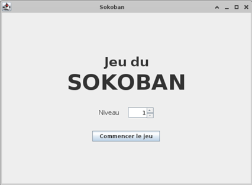
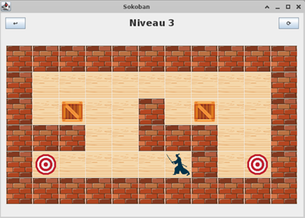
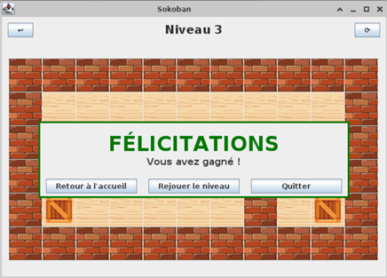

# Sokoban

This project is a Sokoban game developed as part of the Object-Oriented Software Engineering Course at CentraleSupélec. The game is implemented in Java, following the Model-View-Controller (MVC) paradigm.

## Description

Sokoban is a classic puzzle game where the player controls a character who must push boxes onto designated storage locations. The game is played on a grid-based board, and the player's goal is to move all the boxes to their target locations using the least number of moves.

## Features

The game was developed after modeling the game using UML diagrams with Modelio. It was then developed using the MVC paradigm in Java with Eclipse. The game features include:

- Interactive gameplay with keyboard controls
  - using console input
  - using a graphical user interface
- Multiple levels with increasing difficulty

## Preview

Here are some screenshots of the game:

- Home page of the graphical user interface:
  
- Home page of the graphical user interface:
  
- Sucess popup on the graphical user interface:
  